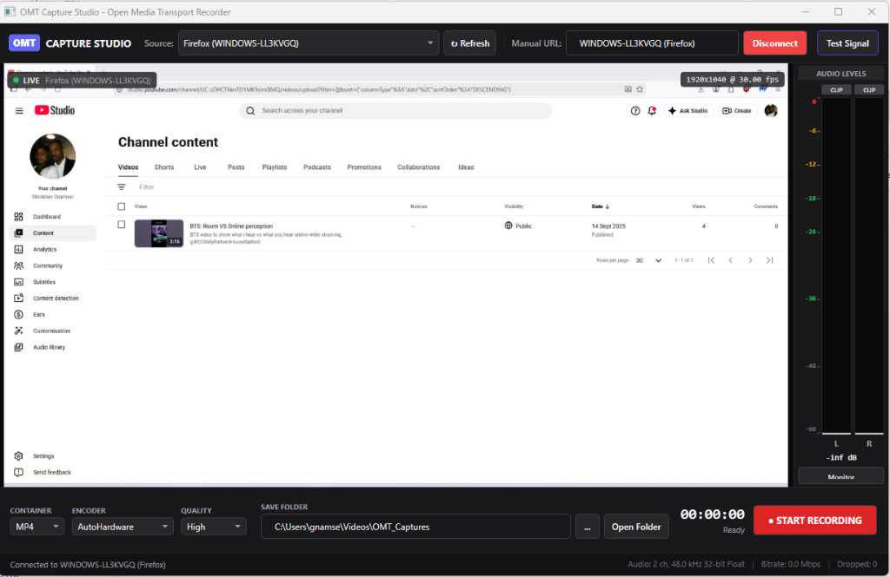

# OMT Capture Studio

A standalone broadcast-grade desktop GUI client for **Open Media Transport (OMT)** to discover, preview, capture, and record video and multi-channel audio directly to disk (`.mp4`, `.mkv`, `.mov`) without requiring OBS Studio or commercial switchers.



---

## Features

- **Automatic Network Discovery**: Integrated mDNS/DNS-SD discovery via `OMTDiscovery` to automatically detect live OMT feeds across the local network with clean, deduplicated naming.
- **Manual URL & Port Entry**: Direct connection support via `omt://<ip>:<port>`.
- **High-Performance Video Viewport**: Zero-copy/low-overhead BGRA rendering via Avalonia Skia `WriteableBitmap` with aspect ratio preservation and live HUD telemetry (resolution, fps, bitrate).
- **Calibrated Multi-Channel Audio VU Metering**: Real-time dBFS peak and RMS volume bars with track-pinned color zones (Green, Amber, Red), peak hold decay, clipping indicators, and Native AOT-safe local audio monitoring via DirectSound/XAudio2.
- **Asynchronous Named-Pipe Recording Engine**: Dual Windows Named Pipes feeding `FFmpeg` to record without frame drops or memory leaks:
  - Formats: **MP4** (H.264/HEVC), **MKV** (crash-resilient), **MOV** (ProRes).
  - Hardware Encoders: Auto Hardware (NVIDIA NVENC, Intel QuickSync, AMD AMF) or CPU (`libx264`).
- **Built-in Test Signal Generator**: Generates 1080p60 SMPTE color bars with motion tick and stereo sine wave tones (440 Hz / 880 Hz) using `OMTSend` for instant offline testing and calibration.
- **Ahead-of-Time (AOT) Compiled**: Native machine code via .NET 8 Native AOT. Zero .NET runtime installation required on target systems.

---

## Deployment & Target Machine Requirements

`OmtCaptureStudio` is built as a fully self-contained Native AOT Windows x64 binary.

### Target Machine Prerequisites

| Prerequisite | Status | Details |
| :--- | :--- | :--- |
| **.NET Runtime** | **Not Required** | Compiled Ahead-of-Time into pure native machine code. |
| **OMT / Codec DLLs** | **Self-Contained** | Embedded directly inside the executable. Automatically self-extracted on first launch. |
| **Visual C++ Redistributable** | **Required** | Standard Microsoft Visual C++ 2015–2022 x64 runtime (`vcruntime140.dll` / `msvcp140.dll`). Present on almost all Windows PCs, or installable via [Microsoft VC++ Redistributable](https://aka.ms/vs/17/release/vc_redist.x64.exe). |
| **FFmpeg (`ffmpeg.exe`)** | **Optional (Recording only)** | Stream discovery, live viewport preview, VU metering, and audio monitoring work with zero external dependencies. If recording video to disk is needed, `ffmpeg.exe` must either be in the system `PATH` or placed in the same folder as `OmtCaptureStudio.exe`. |

---

### Deployment Options

#### Option A: Single Portable Executable (Zero-Install)
Distribute **`OmtCaptureStudio.exe`** as a standalone file.
- All 6 native C++ runtimes (`libomt.dll`, `libvmx.dll`, `libomtnet.dll`, `avutil-omt-57.dll`, `swresample-omt-4.dll`, `swscale-omt-6.dll`) are embedded into the binary.
- On machines without these libraries, `NativePayloadBootstrapper` automatically unpacks them on first run into `%TEMP%\.net\OmtCaptureStudio\{sha256-hash}\` and sets the DLL search path before engine initialization.
- No installer or administrative rights needed.

#### Option B: Release Portable ZIP (Zero-Install Archive)
Download and extract `OmtCaptureStudio-v<version>-win-x64.zip`.
- Contains `OmtCaptureStudio.exe` alongside the native DLLs and documentation.
- Portable execution with zero installation footprint—ideal for USB drives, OB trucks, and portable field troubleshooting.

#### Option C: Windows Setup Installer (Recommended for Workstations)
Download and run `OmtCaptureStudio-v<version>-Setup.exe`.
- Built with Inno Setup with LZMA2 ultra-compression (~17 MB download).
- Automatically configures Windows Start Menu and Desktop shortcuts.
- Registers Windows Defender Firewall rules for OMT discovery (mDNS) and network streaming.
- Checks for Microsoft Visual C++ 2015–2022 x64 Redistributable and offers one-click setup if missing.
- Standard Windows "Apps & Features" Add/Remove support and silent enterprise deployment (`/VERYSILENT`).

---

## Solution Structure

The project is structured as a standard .NET Solution:
- **`OmtCaptureStudio.sln` / `OmtCaptureStudio.slnx`**: The master solution file.
  - **`OmtCaptureStudio`**: Avalonia 11 Native AOT desktop application (.NET 8).
  - **`OmtCaptureStudio.Tests`**: Automated end-to-end verification and diagnostic test suite.

---

## Quick Start

### 1. Building the Solution
Open `OmtCaptureStudio.sln` in Visual Studio 2022, JetBrains Rider, or VS Code, or build via CLI:
```powershell
dotnet build OmtCaptureStudio.sln -c Release
```

### 2. Launching the App
Double-click `Launch-OmtCaptureStudio.bat` or run:
```powershell
dotnet run --project OmtCaptureStudio -c Release
```

### 3. Testing with the Built-in Signal Generator
1. Click the **Test Signal** button in the top right.
2. The client will start broadcasting an OMT feed locally and automatically connect to it.
3. You will see the animated SMPTE color bars in the viewport, the audio VU meters bouncing, and stream specs showing `1920x1080 @ 60 fps, 2 ch 48 kHz`.
4. Click **● START RECORDING** to capture to MP4.
5. Click **■ STOP RECORDING** after a few seconds. The recorded video is saved to `Videos\OMT_Captures`. Click **Open Folder** to view or play it in VLC / Media Player.

### 4. Capturing an External OMT Stream
1. Ensure your camera or production system (e.g., vMix, another OMT sender) is on the same local network.
2. Select the stream from the **Source** dropdown (or type its URL in **Manual URL**).
3. Click **Connect**.
